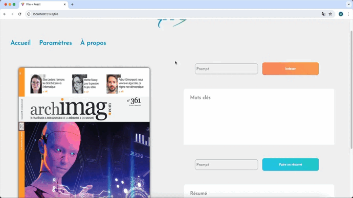
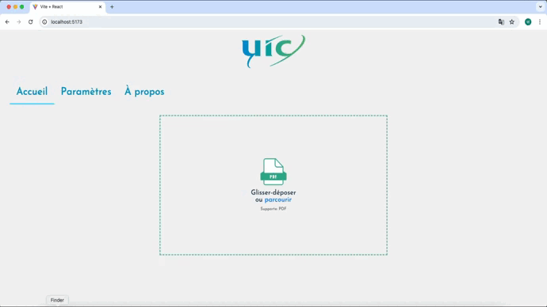
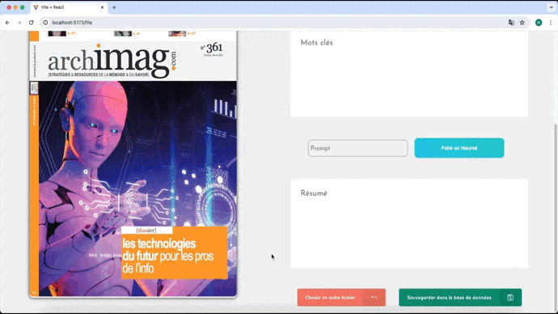
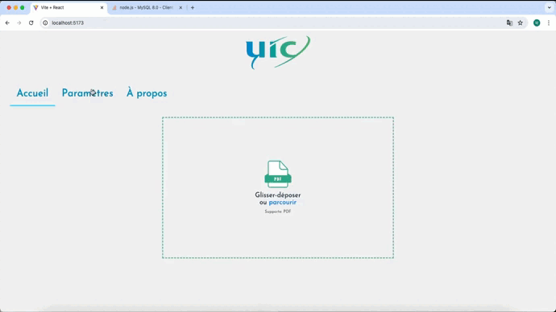

# GED-IA
GED IA est une application web de gestion electronique de documents automatique développée avec React, Node.JS, Scss et l'API d'Open AI. 

## Indexation

## Résumé

## Prompt personnalisé

## Fichier sans table de matières

## Parcourir fichiers

## Ouverture fichier

## Choisir un autre fichier 

## API Key invalide 

## Sauvegarde Base de données

## Live Project 
[https://ged-uic.samidare.co/](https://ged-uic.samidare.co/)
